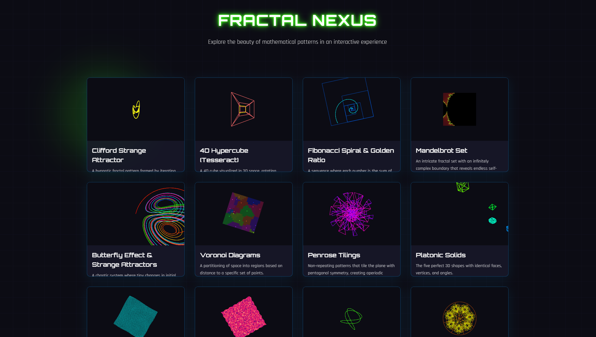
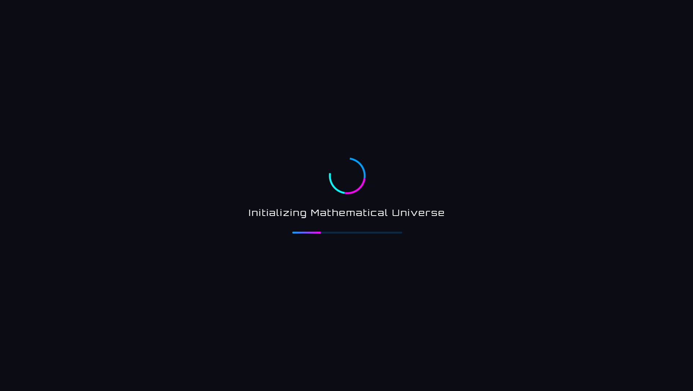
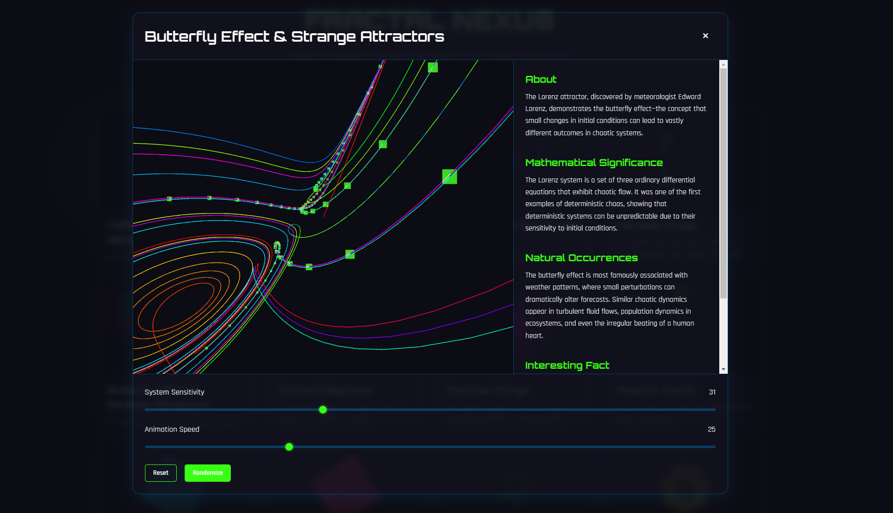

# Fractal Nexus - Mathematical Art Gallery

<div align="center">
  
  
  
</div>

> An interactive mathematical art gallery featuring dynamic visualizations with a cyberpunk/Tron aesthetic.
>
> **Live demo:** https://vrdevil44.github.io/Fractal-Gallery/

[](https://github.com/Vrdevil44/Fractal-Gallery/blob/main/LICENSE)
[](https://github.com/Vrdevil44/Fractal-Gallery/stargazers)

## 🌟 Features

- **Interactive 3D Visualizations**: Powered by Three.js
- **Cyberpunk/Tron Theme**:
  - Neon glow effects
  - Grid background with cyber lines
  - Glass-morphism UI elements
  - Custom color scheme with primary (#00a2ff), secondary (#ff00ff), and accent (#00ffff) colors
- **Responsive Design**: Adapts seamlessly to all screen sizes
- **Loading Animation**: Stylish initialization sequence
- **Interactive Controls**: 
  - Adjustable parameters for each visualization
  - Reset and randomize options
  - Orbital controls for 3D patterns

## 🎨 Mathematical Patterns

- **Clifford Strange Attractor**: Chaotic equations creating hypnotic patterns
- **Wave Interference**: Interactive wave pattern simulations
- **4D Hypercube**: Higher-dimensional geometry visualization
- More patterns coming soon!

## 💻 Technologies Used

- HTML5
- CSS3 (Custom properties, Flexbox, Grid)
- JavaScript (ES6+)
- Three.js for 3D visualizations
- Google Fonts:
  - Rajdhani (Main text)
  - Orbitron (Headings)

## 🚀 Quick Start

1. Clone the repository:
```bash
git clone https://github.com/Vrdevil44/Fractal-Gallery.git
```

2. Navigate to the project directory:
```bash
cd Fractal-Gallery
```

3. Open `index.html` in your browser or use a local server:
```bash
# Using Python
python -m http.server 8000

# Using Node.js
npx serve
```

## �� Project Structure
